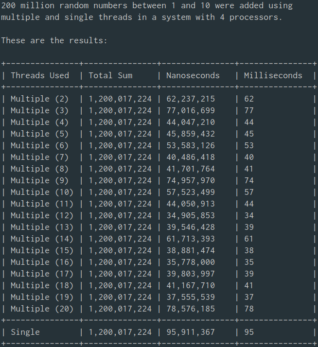
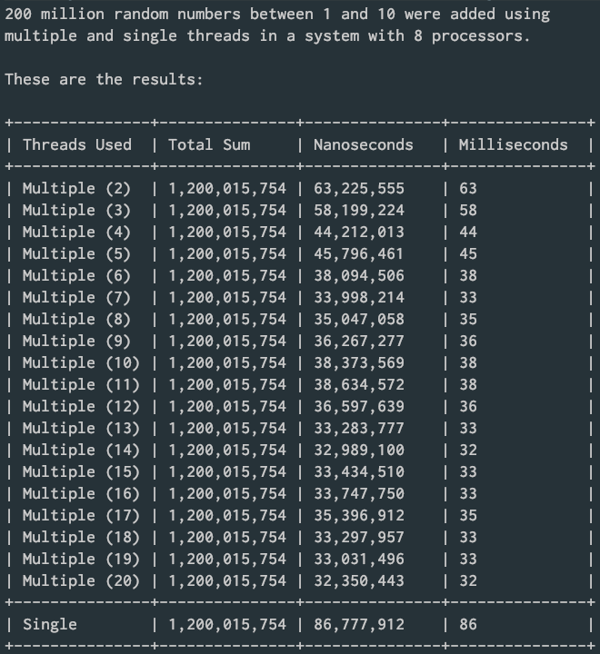
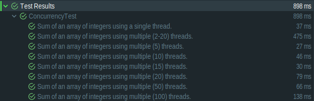
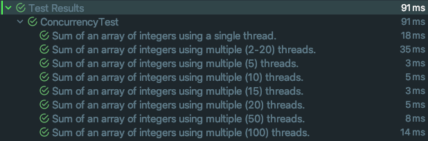

# Concurrency

## Overview
This exercise attempts to implement an application that creates an array of 200 million numbers between 1 and 10 and then computes the sum of those numbers in parallel using multiple threads. It also computes the sum of the numbers using a single thread and displays the sum and processing times for both cases.

## What does this program do?
The program first creates an array of 200 million random numbers between 1 and 10. It will then perform the sum of those numbers using multiple threads. To do that, it will divide the array of numbers into the number of desired threads, starting with two, and will run the threads concurrently (in parallel). When all the threads are done executing the addition, their results will be added together. Finally, the program will display a simple table showing the time of execution corresponding to the number of threads used in each calculation.

## Code design
The code design of the program is not too complicated. It is divided into two classes. The `Concurrency` class sets up and creates the array of numbers that will be used to perform the additions by calling the `AddNumbers` class.

The program is intended to calculate the time of execution of adding a large array of random numbers using single and multiple threads. The `AddNumbers` class extends the Java `Thread` class.

Single thread processing implements a simple algorithm to add the numbers in the array by iterating through the array and adding the numbers in each index.

Multi-thread processing will divide the `arrayOfIntegers` into sections equal to the number of threads that will be used to add them. Each section will be sent to a Thread object and start the thread by calling the `start()` method, which in turn calls the Thread `run()` method. The `run()` method will call the `singleThreadSum()` method for each thread. Finally, the Thread `join()` method is called to ensure that all threads complete their execution before their individual results are added together.

 Based on several sources I researched, the practical and perhaps the most efficient approach to this exercise is to execute as many threads as there were processors present in the system. However, my testing showed that while the number of processors played an important role in the execution time of the threads (see [Unit Tests](#unit-tests "Unit Tests")), more comparable results could be observed by defining a larger number of threads to use (I tested the program with as many as 200 threads) (see [Known Issues](#known-issues "Known Issues")).

## Test plans and standards
The program was not developed using TDD (Test Driven Development) standards. However, unit tests were created using JUnit. Testing was performed exclusively to ensure that the methods in the `AddNumbers` class were properly adding the numbers in the provided array. 

## System requirements
The program was coded using version 11 of Amazon's distribution of the Open Java Development Kit (OpenJDK) [Corretto 11](https://aws.amazon.com/corretto/). Unit tests were created using [JUnit 5](https://github.com/junit-team/junit5/).

## How to use this program.
The program requires no user interaction other than compilation and execution. The results of the additions using multiple and single threads are displayed to the console in a simple, easy to read table. The user may want to change the number of elements in the random number array, which is initially set at 200 million, by editing the `randomNumberArrayLength` variable in line 31 of the `Concurrency` class.
```
33    /**
34     * The random number array length.
35     */
36    static int randomNumberArrayLength = 200000000;
```

The user may also want to change the maximum number of threads used to perform parallel sums. The initial value is 20, but can be changed by editing the `maximumNumberOfThreads` variable in line 41 of the `Concurrecy` class.
```
38    /**
39     * The maximum number of threads to use.
40     */
41    static int maximumNumberOfThreads = 20;
```

## Installation.
To install the program, simply clone the repo, open it in your favorite IDE, and run it. Make sure that Java JDK 11 and JUnit 5 are installed in your system. 

## Known Issues
1. No graceful handling of `InterruptedException` in the `multipleThreadSum` method has been implemented. This is because an `interrupt` on a `Thread` object must be invoked explicitly. For purposes of this program, there is no need to invoke an `interrupt` because the `randomNumberArrayLength` is kept reasonably low so as to not compromise system resources (values over 500 million / 1 billion may exceed the available heap in systems with 8GB/16GB ram, respectively).
2. JUnit can adequately test that the relevant methods in the `AddNumbers` class perform as expected: that the `singleThreadSum` and `multipleThreadSum` methods can properly add the numbers in a given array of integers. I have been able to verify that the `multiThreadSum` method does create independent threads, as it is meant to do with the `start()` method. However, I am unable to use JUnit to test/verify if the multiple threads are, indeed, running concurrently. From what I researched, it seems that it is not possible to definitively test if multiple threads are running simultaneously. I came across [MultithreadedTC](https://code.google.com/archive/p/multithreadedtc/), a framework for testing concurrent applications, but it is quite dated and is only "friendly" with JUnit 4. 

## Version history
The version numbering of this project does not follow most version numbering guidelines. Rather, it is limited to a two-token concept: 

```(major).(course module)``` 

```
Version 1.8 (current) - First version
```

## Sample results
### Quad-core system

### Octa-core system


## Unit Tests
### Quad-core system

### Octa-core system

